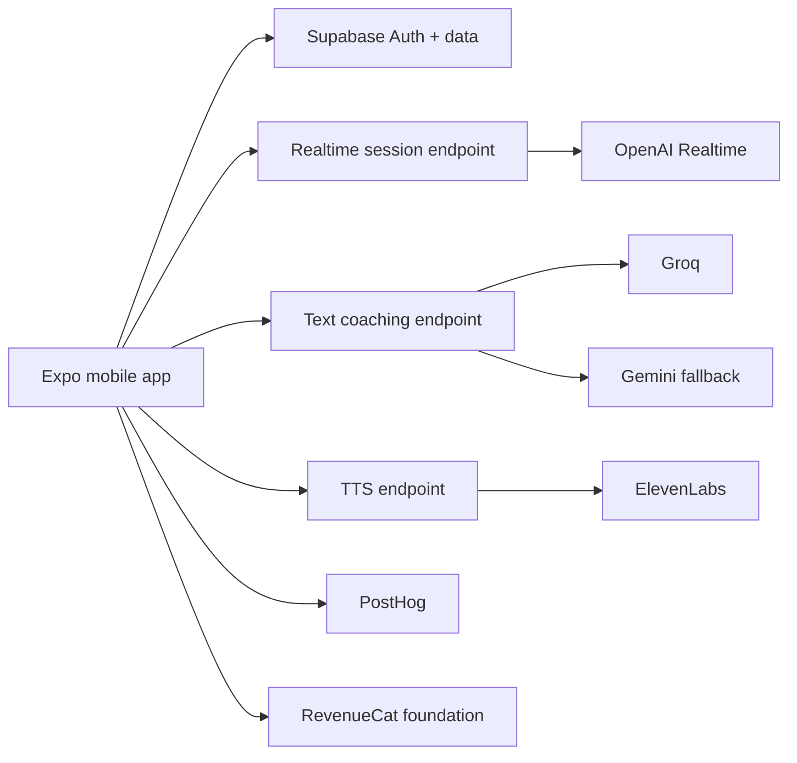

# Voxa

<p align="center">
  
</p>


[](https://github.com/BTheCoderr/Voxa/actions/workflows/mobile-ci.yml)


**App Store:** https://apps.apple.com/app/voxa-ai-speaking-practice/id6771445659


<!-- repo-intro:start -->
**Project snapshot:** Voxa is a mobile-first AI speaking-practice app for iOS and Android. It combines realistic conversation scenarios, realtime voice, lower-cost text/dictation practice, structured corrections, daily missions, progress tracking, and synced practice history.

**What it demonstrates:** Expo / React Native · TypeScript · OpenAI Realtime · Groq + Gemini fallback · Supabase · ElevenLabs · RevenueCat integration foundation · PostHog · EAS/TestFlight release engineering.
<!-- repo-intro:end -->

> **Practice real conversations out loud.**

<!-- portfolio-visuals:start -->
<p align="center">
  
</p>

<p align="center"><strong>Realtime speaking practice for work, travel, and everyday conversations.</strong></p>
<!-- portfolio-visuals:end -->

Voxa is designed for the conversations that are hard to rehearse alone: interviews, meetings, travel, networking, small talk, customer support, restaurants, and dating.

Instead of turning speaking practice into another classroom-style lesson, Voxa puts the user inside a realistic scenario and gives lightweight coaching after they respond.

## Product experience

### Practice

- daily speaking mission
- scenario-based sessions with a clear skill focus and goal
- Business English, Spanish, and Mandarin learning paths
- voice-first realtime conversations
- lower-cost text + dictation practice
- structured corrections without turning every response into a grade
- per-language Beginner / Intermediate / Advanced coaching difficulty
- targeted replay from saved coaching focus and correction history

### Progress

- XP
- speaking-day streaks
- five progression stages: **Foundation → Momentum → Flow → Range → Presence**
- Coaching Journal with saved recaps and corrections
- long-term Coaching Memory + Correction Mastery
- stable Weekly Coach Plans with targeted reps
- evidence-based Adaptive Difficulty recommendations
- factual recent-vs-earlier Progress Trends
- respectful in-app Come-back nudges with daily dismissal + opt-out
- local-first progress before account creation

### Product operations

- tester-facing AI/realtime diagnostics
- EAS build configuration
- TestFlight checklist
- App Store metadata and screenshot plan
- privacy/security documentation
- separate Next.js marketing site under `/marketing`

## Architecture



Provider secret keys do not belong in the public mobile bundle. Realtime, text-generation, and TTS provider credentials are kept behind server-side functions.

## AI delivery strategy

Voxa uses different AI paths for different product needs rather than forcing every interaction through the most expensive mode.

- **Realtime voice:** OpenAI Realtime for natural speech-to-speech practice.
- **Text coaching:** Groq as the primary lower-cost path with Gemini fallback.
- **Voice playback:** ElevenLabs through a server-side function.
- **Diagnostics:** dedicated health/configuration surfaces help testers distinguish provider outages from client bugs.

That split keeps the experience flexible while giving the product multiple cost/performance options.

## Tech stack

| Layer | Technology |
| --- | --- |
| Mobile | Expo 54, React Native 0.81, Expo Router |
| Language | TypeScript |
| Auth + data | Supabase |
| Realtime voice | OpenAI Realtime |
| Text AI | Groq + Gemini fallback |
| TTS | ElevenLabs |
| Local persistence | AsyncStorage / SecureStore |
| Analytics | PostHog |
| Purchases foundation | RevenueCat |
| Builds/releases | EAS |
| Marketing | Next.js app in `/marketing` |

## Repository structure

```text
app/              Expo Router screens and navigation
components/       reusable mobile UI
lib/              AI, auth, persistence, analytics, and product logic
assets/           app icons and visual assets
supabase/         backend functions / database work
docs/             architecture, security, release, QA, screenshots
marketing/        separate web marketing site
eas.json          release profiles
app.json          native app configuration
```

## Local setup

```bash
cp .env.example .env
npm install
npm start
```

For native voice functionality, use a development or production build rather than Expo Go.

```bash
npm run ios
# or
npm run android
```

Release builds should use EAS-managed environment secrets instead of committed provider credentials.

## Release engineering

The repository tracks the non-code work needed to ship a mobile AI product, including:

- bundle identifiers and native permission strings
- EAS release configuration
- auth redirect requirements
- physical-device QA
- TestFlight testing notes
- App Store metadata
- screenshot capture plan
- security boundaries
- provider-specific architecture documentation

## Key documentation

- [Architecture](./docs/ARCHITECTURE.md)
- [AI providers](./docs/AI_PROVIDERS.md)
- [Realtime session flow](./docs/REALTIME_SESSION.md)
- [Security](./docs/SECURITY.md)
- [EAS build guide](./docs/EAS_BUILD.md)
- [TestFlight checklist](./docs/TESTFLIGHT.md)
- [Beta QA checklist](./docs/BETA_QA_CHECKLIST.md)
- [App Store metadata](./docs/APP_STORE_METADATA.md)
- [Screenshot plan](./docs/SCREENSHOTS.md)

## Repository guide

- [CHANGELOG.md](./CHANGELOG.md) — release history
- [ROADMAP.md](./ROADMAP.md) — product direction
- [docs/README.md](./docs/README.md) — current vs. historical documentation
- [CONTRIBUTING.md](./CONTRIBUTING.md) — development expectations
- [SECURITY.md](./SECURITY.md) — vulnerability reporting
- [.github/workflows/mobile-ci.yml](./.github/workflows/mobile-ci.yml) — automated quality gates

## Repository quality gates

Pull requests run mobile TypeScript, Deno checks for server-side Edge Functions, and a production build of the Next.js marketing site.

**GitHub merge, EAS/App Store release, and Netlify publication are separate actions.**

## License

Copyright © 2026 Baheem Ferrell. All rights reserved. This public repository is viewable for portfolio, review, and collaboration purposes and is not released under an open-source license. See [LICENSE](./LICENSE).

## Product principle

Voxa rewards **showing up and speaking**, not perfect answers.

The goal is short, realistic practice that builds comfort through repetition.
