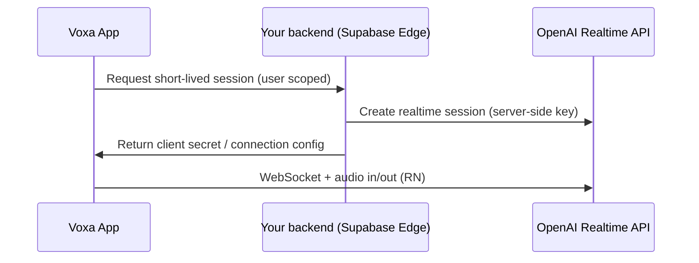

# Voxa — App architecture

## Product spine

Voxa is **conversation-first**: the realtime voice session is the hero experience. Onboarding exists only to reduce friction into the first successful speak-aloud moment. Progress (streak, XP) reinforces habit without cartoon gamification.

## High-level layers

| Layer | Responsibility |
|--------|----------------|
| **App (Expo Router)** | Navigation, screen composition, route-level loading states |
| **Design system** | Color, type, spacing, glass surfaces, motion tokens |
| **Feature modules** | Onboarding, scenarios, conversation (realtime), history, progress |
| **Services** | Supabase (auth + data), OpenAI Realtime (voice), PostHog, RevenueCat |
| **Sync / offline-first (MVP)** | AsyncStorage for onboarding + local progress; Supabase as source of truth when signed in |

## Runtime data flow (voice)

**Important:** publishable/anon keys and end-user devices must not hold your OpenAI **secret**. The app scaffold expects a small server endpoint (e.g. Supabase Edge Function) to mint ephemeral Realtime credentials.

## Navigation map

- **Bootstrap** (`app/index.tsx`): routes to onboarding or main tabs based on local onboarding flag and optional auth.
- **Onboarding stack** (`app/(onboarding)`): welcome → language → goals → microphone copy → handoff to sign-in or home.
- **Main shell** (`app/(app)/(tabs)`): scenarios home, progress, profile.
- **Modals / stacks** (`app/(app)`): scenario detail route, conversation session, history.

## Supabase (intended schema, not yet migrated)

Minimum tables for MVP:

- `profiles` — `user_id`, display name, locale, `xp`, `streak_current`, `streak_best`, `last_session_at`
- `conversations` — `id`, `user_id`, `scenario_id`, `language`, `started_at`, `ended_at`, `summary_json` (optional)
- `conversation_turns` — optional normalized log for replay; alternatively store blob in `conversations`

Row Level Security on all user-owned tables (`auth.uid()`).

## Observability & monetization

- **PostHog** — funnel: onboarding completion, first session start, session length, subscription state
- **RevenueCat** — entitlement gating for premium scenarios / longer sessions (wire in `lib/purchases`)

## Security notes

- Never ship `service_role` or OpenAI secret keys in the client.
- Treat transcripts as sensitive; prefer server-side retention policies and minimal logging in analytics.
